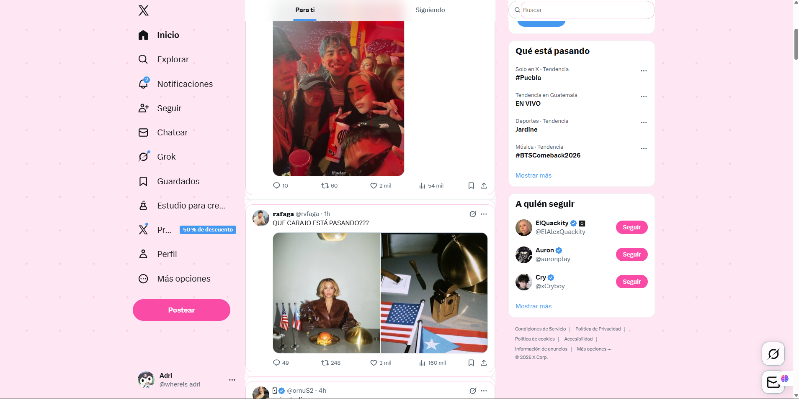

# Daisy and the Silent Streets 

An interactive **Choose Your Own Adventure** story where you guide Daisy through mysterious silent streets, making choices that shape her journey and destiny.

## Overview

This project is a narrative-driven interactive experience built with **pure HTML + CSS** and served through **NGINX**. Navigate through branching storylines where your decisions matter. The interface features custom styling with themed fonts, dialog-style buttons, framed images, and dynamic backgrounds that change based on the story phase—all without a single line of JavaScript.

## Technologies Used

- **HTML** — Pure semantic markup for structure and navigation
- **CSS** — Styling, animations, and layout (no inline styles)
- **NGINX** — High-performance web server
- **Git & GitHub** — Version control and collaboration
- **Linux Terminal** — Ubuntu/Debian for file management and deployment

## Project Structure
```
├── intro/          
├── story/         
├── endings/       
├── css/           
├── images/         
└── fonts/          
```

## Video
https://www.canva.com/design/DAHBdTjOCYc/sANsaGCVQjP_oU_j46MKTQ/edit?utm_content=DAHBdTjOCYc&utm_campaign=designshare&utm_medium=link2&utm_source=sharebutton

### Prerequisites

- NGINX installed and running on your system
- Access to terminal/command line
- Basic familiarity with Linux commands

### Installation & Deployment

1. **Clone the repository**:
```bash
   git clone <repository-url>
   cd Lab-2-CSS-ADVENTURES
```

2. **Copy project files to NGINX web directory**:
```bash
   sudo cp -r Lab-2-CSS-ADVENTURES /var/www/html/daisy-adventure
```

3. **Set appropriate permissions**:
```bash
   sudo chmod -R 755 /var/www/html/daisy-adventure
```

4. **Access the story** in your web browser:
```
   http://localhost/daisy-adventure/intro/index.html
```

## Before vs After (RICING)

### Before


### After

---
